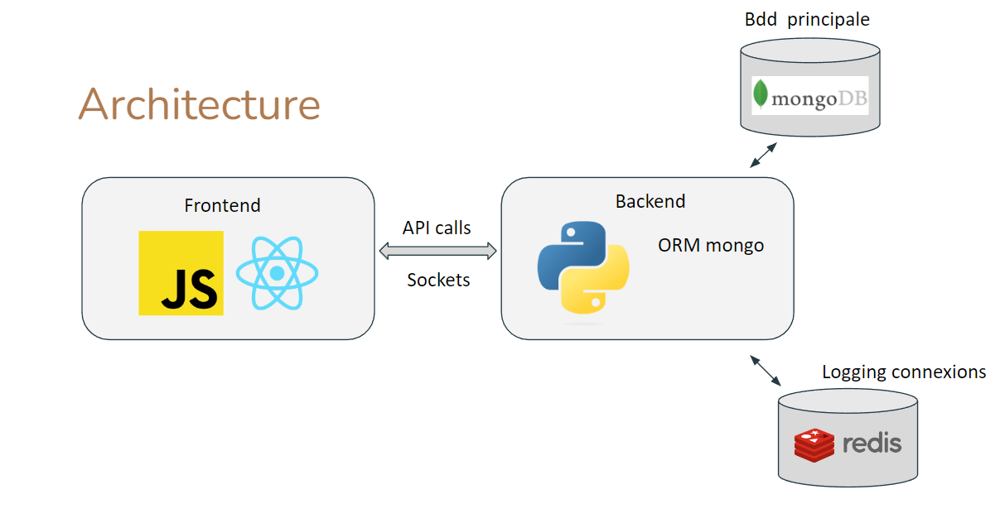
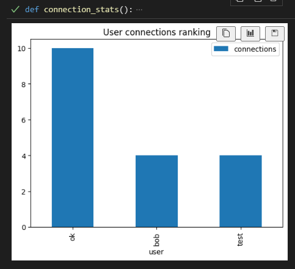
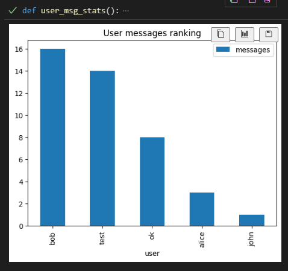
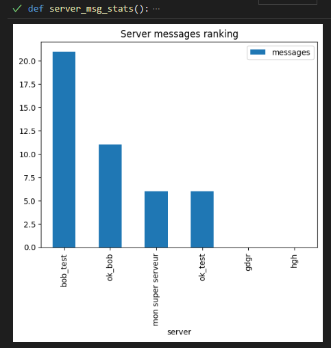

# Discord Replica

NICOLAS Thomas, RIBES Maël, SIMONET Théo

This project was completed as a group effort. The objective was to create a chat application that mimics the functionality of Discord. This means a user can join multiple servers, each containing several topic-centered channels that serve as chat rooms. It is also possible to add users as friends for private communication.

[](https://react.dev)
[](https://www.python.org/)
[](https://www.mongodb.com/fr-fr)
[](https://redis.io/)
[](https://www.docker.com)

# Architecture

## Structure

```python
📦 Discord-Replicat
├─ 📁 Frontend
│  └─ 📁 src
│     ├─ 📝 Dockerfile  # Dockerization of the Frontend
│     ├─ 📁 components  # React Components
│     │  ├─ 📝 FriendView.jsx   # Friends view: list of friends + conversations
│     │  ├─ 📝 ServerList.jsx   # Server list
│     │  └─ 📝 ServerView.jsx   # Server view: channels + chat
│     ├─ 📁 pages   # Application pages
│     │  ├─ 📝 login/login.jsx  # Login page
│     │  └─ 📝 app.jsx  # Application post-login
│     └─ 📁 Styles
├─ 📁 Backend
│  ├─ 📝 backend.py  # Python API
│  ├─ 📝 db.py  # Database manipulation functions
│  ├─ 📝 Dockerfile  # Dockerization of the Backend
│  ├─ 📝 models.py  # ORM models for MongoDB
│  └─ 📝 tests.py   # Database tests
├─ 📁 data 
│  ├─ 📁 db_primary   
│  ├─ 📁 db_secondary1   # Folder to back up locally the DB
│  └─ 📁 db_secondary2
├─ 📁 scripts
│  └─ 📝 init-replica-set.sh   # Initialization of the replica set
├─ 📁 infos
│  └─ 📝 stats.py   # User statistics functions
├─ 📝 docker-compose.yml   # Create, configure, and launch containers
└─ 📝 start.sh   # Script to launch the application (launch docker compose and initialize replica set)
```

## Technologies



For the frontend, we use the React JS library to build our UI. React communicates with our Python Backend through API calls to fetch database information, as well as through websockets enabling real-time UI updates, such as handling new messages.

Our Python backend implements the `pydantic_mongo` library to define models corresponding to our data and use repositories to communicate with our MongoDB database. Finally, we use a second Redis database to hot-store user connections and determine if a user is presumably connected or not.

## Routes

| Route              | Method | Description          |
|--------------------|--------|----------------------|
| `/api/server`      | GET    | Get a server         |
| `/api/server`      | POST   | Add a server         |
| `/api/server`      | PUT    | Update a server      |
| `/api/user`        | GET    | Get a user           |
| `/api/user`        | POST   | Create a user        |
| `/api/user/login`  | POST   | User connection      |
| `/api/chat`        | GET    | Get private message  |
| `/api/friend`      | POST   | Add a friend         |
| `/api/get_user_redis` | GET    | Get a redis user     |

## MongoDB 

Data is structured as follows:
- a `server` collection for servers.
- a `user` collection for users.

A server is a document of the form:
```javascript
{
    "id" : ... , // MongoDB server ID
    "type" : ... , // To differentiate between server and private conversation
    "name" : ... , // Server name
    "members" : [...], // List of server members
    "channels" : [...] // List of server channels
}
```
A member is an object of the form:
```javascript
{
    "user" : ... , // Corresponding user's MongoDB ID
    "role" : ...  // Admin or user
}
```
A channel is an object of the form:
```javascript
{
    "name" : ... , // Channel name
    "messages" : [...]  // List of channel messages
}
```
A message is an object of the form:
```javascript
{
    "from_user" : ... , // User's MongoDB ID
    "sent_at" : [...],  // Message date
    "content" : ... // Message content
}
```
Finally, a user is a document of the form:
```javascript
{
    "id" : ... , // User's MongoDB ID
    "login" : [...],  // User login
    "password" : ... , // Password
    "nickname" : ... , // User name
    "friends" : [...] // List of friend user IDs
}
```

With `pydantic_mongo`, we can then define models for each object/document to ensure data consistency:
```python
class Server(BaseModel):
    id: ObjectIdField = None
    type : bool
    name : str
    members : list[Member]
    channels : list[Channel] 
```

Private conversations are managed as follows:
- A private conversation is a server named username1_username2 without an administrator and with a single channel.

## Redis

To know if a user is connected or not, each user connection sets the user's name key to 1 in Redis.

To keep track of the number of connections, an entry containing the user's name is added to a Redis stream upon each connection. The key of the entry will automatically be the entry's date.
```python
r.set(username, 1) # User connected
r.xadd("connections", {'username' : username}) # Logging the connection to the connections stream
```

Upon disconnection, the user's key is deleted to indicate they are no longer connected:
```python
r.delete(socketio.server.get_session(sid).get('username')) # Removing the entry corresponding to the user
```

## Docker

After our application was fully functional and all the desired features were working correctly, we decided to dockerize the project. Dockerizing an application offers numerous benefits. Firstly, it ensures consistency across different environments, as Docker containers encapsulate the application and its environment. This eliminates the often-heard issue of "it works on my machine." By dockerizing, we guaranteed that the application would run the same way regardless of where it is deployed.

To dockerize our project, we first needed to build Docker images for our backend and frontend. We created a Dockerfile at the root of the backend and frontend directories for this purpose. These Dockerfiles are crucial as they automatically download the dependencies for the backend and frontend and then launch them. This automation streamlines the setup process, making it faster and more error-resistant.

Once the backend and frontend images were created, we proceeded to develop a [`docker-compose.yml`](docker-compose.yml) file. This file plays a key role in orchestrating the application, as it is used to create, configure, and launch containers for all the application's services, including the backend, frontend, Redis, and MongoDB. Docker-compose not only simplifies the deployment process but also makes it easier to manage and scale the application's components. This comprehensive approach ensures a cohesive and efficient deployment, enhancing both development and operational efficiency.

# ReplicaSet

A Replica Set in MongoDB is a group of MongoDB servers working together to ensure high availability and automatic recovery in case of failure. It consists of several MongoDB instances, one of which is the primary node, and the others are secondary nodes.

The primary node receives all write operations and propagates changes to the secondary nodes. The secondary nodes replicate data from the primary node and are used for read operations. If the primary node fails, one of the secondary nodes is automatically elected as the new primary node, ensuring that the system remains available.

Replica sets offer several advantages, including high availability, automatic recovery in case of failure, and scalability.

To initialize a replica set with MongoDB, there are several ways to do it. Here is the manual way using command line:

```shell
Console serv1
mongod --replSet rs0 --port 27017 --dbpath C:\data/R0S1

Console Admin:
mongosh --port 27017
rs.initiate()
rs.config()

Console serv2:
mongod --replSet rs0 --port 27018 --dbpath C:\data/R0S2

Console serv3:
mongod --replSet rs0 --port 27019 --dbpath C:\data/R0S3

Console Admin:
rs.add("localhost:27018")
rs.add("localhost:27019")


Console Arbitre:
mongod --port 30000 --dbpath C:\data/arb --replSet rs0


Console Admin:
db.adminCommand( { setDefaultRWConcern : 1, defaultReadConcern: {level : "majority"},defaultWriteConcern: {w : "majority"}})
rs.addArb("localhost:30000")
```

Since our project is already containerized with Docker, we can take advantage of this to automate the launch of the replica set. The tutorial **[replica_set_tutorial.md](Replica_Set_Tutorial.md)** explains step by step how to initialize a MongoDB replica set with Docker. It closely follows what we used in the project.

# Developed Features

- User connections
- Server management
- Real-time display of connected users indicated by the circle next to a user's username
- Management of rooms within a server
- Friends list
- Private conversations
- Verifications (checking login fields, can't add the same user twice to a server or as a friend, uniqueness of private conversations between two users)
- Server and user stats
- MongoDB database Replica set
- Docker containerization of the project

# Stats

The `stats.py` file allows obtaining stats on the application from Redis, MongoDB, and pandas.
First, a diagram of the most frequently connecting users by manipulating the data from the Redis connections stream.



Then the users who send the most messages from MongoDB and an aggregates pipeline:



Finally, the servers with the most messages, still with MongoDB:



# Acquired Skills

- Deployment of NoSQL databases in an application
- Database replication for resilience
- Use of secondary databases for hot storage (logs, real-time connection management)
- Management of sockets between FrontEnd and BackEnd
- Aggregates pipeline for MongoDB
- Learning how to dockerize an application


# Installation

Prerequisites:
- Have Docker installed

Installation:
- Open a terminal at the root of the project and run `./start.sh`. This should build the Mongo, Redis, backend, and frontend containers, and start the application on `localhost:3000`.

**Note**: Do not refresh the page while the application is running, or there will be socket bugs.
